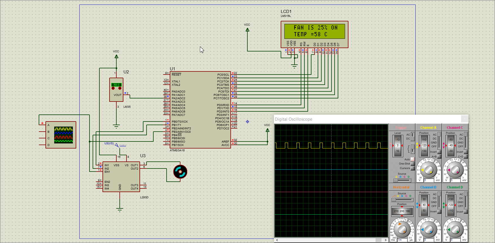
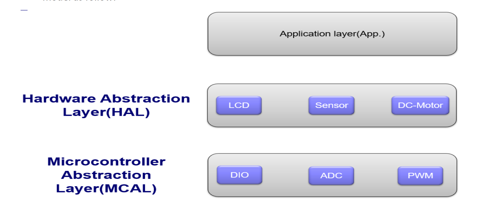

# temperature to  Fan control system

    this project main idea is to take the temperature from LM35 temperature sensor then using adc to convert the signal to digital 
    after that using the value to display it on the screen and produce pwm signal to the fan.
    the target was AVR16 

## System layer architecture:

## System behavior:
- In this project, the LM35 temperature sensor will give continuous analog output corresponding to the temperature sensed by it. This analog signal is given to the ADC, which converts the analog values to digital values.

- The digital output of the ADC is equivalent to sensed analog voltage.
- In order to get the temperature from the sensed analog voltage, we need to perform some
calculations in the programming for the microcontroller.
- Once the calculations are done by the microcontroller according to the logic, the
temperature is displayed on the LCD.
- The microcontroller will continuously monitor the temperature and based on the
temperature value, the microcontroller will drive the fan like that:
    - If the temperature is less than 30C turn off the fan.

    - If the temperature is greater than or equal 30C turn on the fan with 25% of its
    maximum speed.
    - If the temperature is greater than or equal 60C turn on the fan with 50% of its
    maximum speed.
    - If the temperature is greater than or equal 90C turn on the fan with 75% of its
    maximum speed.e.
    - If the temperature is greater than or equal 120C turn on the fan with 100% of its
    maximum speed.
- The main principle of the circuit is to switch on/off the fan connected to DC motor based
on temperature value. The DC-Motor rotates in clock-wise direction or stopped based on
the fan state.
- The LCD should display the temperature value and the fan state continuously

- Control the DC-Motor speed using PWM signal generated from Timer0.
